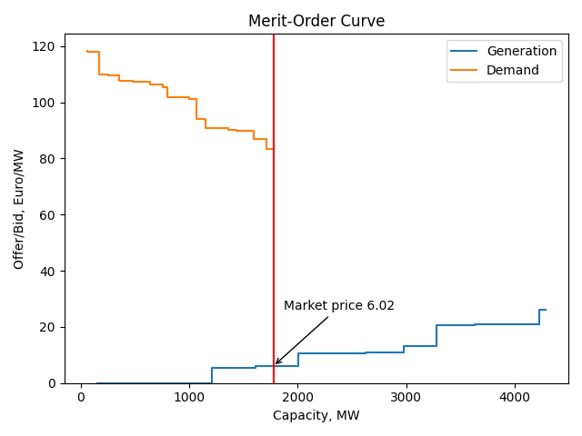
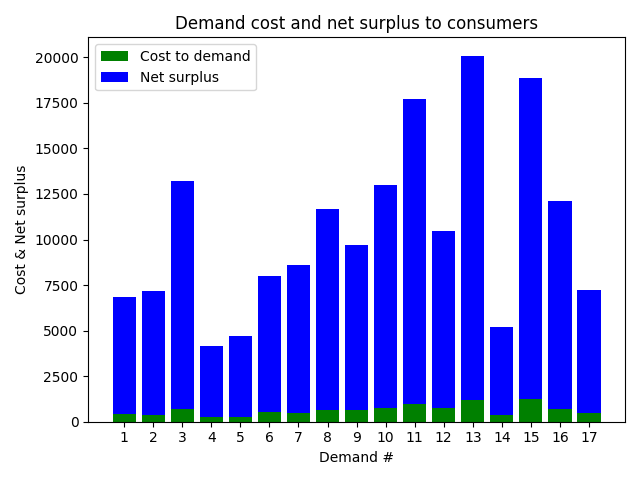
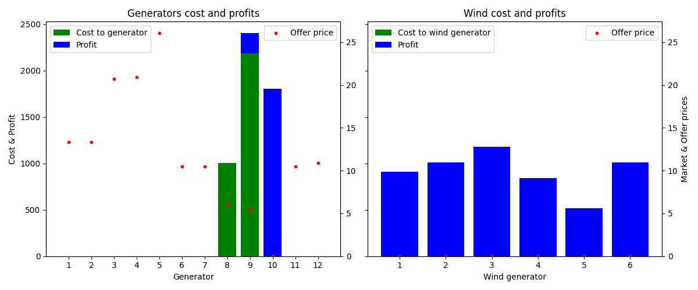

# Electricity Market Clearing for a Single-Hour Copper-Plate system

# Project Overview

<ins>**Aim:**</ins> Determine the market clearing price of a theoretical power grid with 17 demand centres, 12 traditional generators and 6 wind farms

<ins>**Objective:**</ins>  Implement a linear optimisation model to maximise total system welfare

<ins>**Electricity generation technologies:**</ins> Traditional Fossil  |  Wind

## Technical Skills
<ins>**Python libraries:</ins>** matplotlib  |  pandas  |  Pyomo

<ins>**Skills:</ins>** Linear optimisation  |  Data visualisation  |  Electricity markets

## Analysis

The system market clearing price was 6.02, with the merit order curve constructed below. 

On the demand side, demand centres realised significant savings against the bid prices, resulting in large net surplus. 

On the supply side, wind farms were the dominant generating technology, with only several traditional fossil units committed for the modelled hour. 

